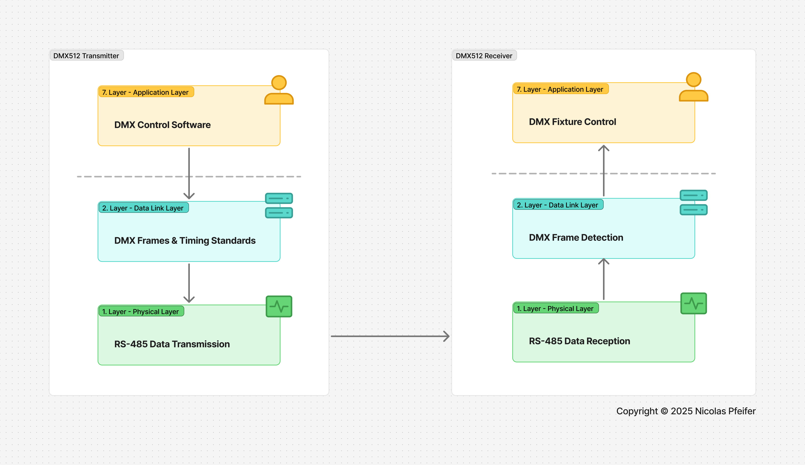

# DMX4ESP - DMX Library for esp32
This library helps sending and receiving DMX-512 data using any esp32 microcontroller.

## About DMX-512

DMX-512 (Digital Multiplex) is the standard protocol used in the entertainment and lighting industry for example to controll stage lighting, effects and other devices. It was developed by the Engineering Commission of the United States Institute for Theatre Technology (USITT) in 1986.

## DMX-512 Protocol

The DMX-512 Protocol is based on the RS-485 Standard as the physical layer for communication.

*OSI Model how dmx is transmitted/received.*

## Physical Layer: RS-485
- **Differantial Communication** with **A/B data lines**
- **Up to 1000m distance** without significant data loss
- **Noise immunity**

## Data Link Layer: Packet Structure

Any DMX Frame has to consist of the following components:

1. **Break** Signal (>88µs)
    - Signals the start of the DMX packet
    - Set Break Signal by inversing the two data lines
2. **Mark After Break** Signal (>88µs)
    - Prepare receivers to receive data
3. **Start Code** (1 Byte)
    - Normally 0x00 for default control
    - See examples for other usecases
4. **DMX Data** (512 Bytes)
    - Data of each 512 DMX Channels with a 8-bit resolution (0 - 255)

## Timing

| **Parameter** | **Description** | **t - min** | **t - typ** | **t - max** |
| --- | --- | :---: | :------:   | :---: |
| Break |  | 88µs | 88µs - 125µs | - |
| Mark After Break |  | 8µs | - | 1s |
| Start Code | Baud-rate: 250kbps | 44µs | 44µs | 44µs |
| Mark Time Between Frame | Idle | 0µs | 0µs | 1s |

*NOTE: this integration currently supports following chipsets: MAX485, 74HC04D*