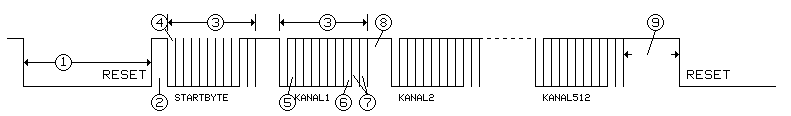

 

# DMX4ESP - DMX Library for esp32
DMX4ESP is a lightweight and efficient library for sending and receiving DMX-512 data using any esp32 microcontroller.

## Features

✅ Send DMX-512 data

❌ Receive DMX-512 data (not supported, see the [dmx4esp experimental version](https://github.com/nicode3141/dmx4esp/tree/master) for details)

✅ Uses esp32 hardware UART

✅ Compatible with ESP-IDF

## Jump To

- [DMX-512 explained](#about-dmx-512)
- [Getting Started](#getting-started)

--- 

## About DMX-512

DMX-512 (Digital Multiplex) is the standard protocol used in the entertainment and lighting industry for example to control stage lighting, effects and other devices. It was developed by the Engineering Commission of the United States Institute for Theatre Technology (USITT) in 1986.

## DMX512-A Technical Specifiations

| **Category** | **Specification** |
| :--- | :--- |
| Standard Name | DMX512-A [(ANSI E1.11)](https://tsp.esta.org/tsp/documents/docs/ANSI-ESTA_E1-11_2008R2018.pdf) |
| Physical Layer | RS-485 |
| Channels | 512 Channels |
| Baud Rate | 250 kbits/s |
| Voltage | -7 to 12 V (RS-485) |
| Data Resolution | 8-bits / Channel |

## DMX-512 Protocol

The DMX-512 Protocol is based on the RS-485 Standard as the physical layer for communication.


*OSI Model how dmx is transmitted/received.*


## Physical Layer: RS-485
- **Differential Communication** with **A/B data lines**
- **Up to 1000m distance** without significant data loss
- **Noise immunity**


## Data Link Layer: Packet Structure

Any DMX Frame has to consist of the following components:

1. **Break** Signal (>88µs)
    - Signals the start of the DMX packet
    - Set Break Signal by inversing the two data lines
2. **Mark After Break** Signal (>8µs)
    - Prepare receivers to receive data
3. **Channel Slots** (1 Byte)
    - Slots for each Byte
4. **Start Code** (1 Byte)
    - Normally 0x00 for default control
    - <a href="#start-codes" style="color: black; text-decoration: underline;text-decoration-style: line;">See examples for other usecases</a>
5. **DMX Data** (512 Bytes)
    - Data of each 512 DMX Channels with an 8-bit resolution (0 - 255)



*timing diagram of a dmx-512 data stream [1]*


## Timing

| **Parameter** | **Description** | **t - min** | **t - typ** | **t - max** |
| --- | --- | :---: | :------:   | :---: |
| Break |  | 88µs | 88µs - 125µs | - |
| Mark After Break |  | 8µs | - | 1s |
| Start Code | Baud-rate: 250kbps | 44µs | 44µs | 44µs |
| Mark Time Between Frame | Idle | 0µs | 0µs | 1s |

## Start Codes

| **Hex** | **Description** | **Registered To** |
| :--- | :--- | :--- |
| 0x00 | Default Format to control lighting | USITT |
| 0x55 | Network Test | E1 |
| 0x17 | Text Packet | E1 / Artistic Licence (UK) Ltd. |
| 0xCC | Remote Device Management | E1 |
| 0xCF | System Information Packet | E1 |
| 0xFF | Dimmer Curve Select | Avolites |

*common start codes for DMX*

---

# Getting Started

## Hardware Requirements

- ESP32 Microcontroller
- RS-485 interface. Supported chipsets:
    - MAX485
    - 74HC04D

## Installation

### ESP-IDF (minimum version required: 4.3)

Clone the `src` folder inside your own `components` directory.

```c
#include "dmx4esp.h"
```

## Wiring Diagram


*MAX485 Breakboard with esp32*

## Library Usage

### Initialization & Setup

```c
//configure pinout for rx, tx & direction ports
dmxPinout dmxPins = {
    .tx = GPIO_NUM_43,
    .rx = GPIO_NUM_44,
    .dir = GPIO_NUM_1
};

//apply pinout
setupDMX(dmxPins);

//start dmx service
initDMX(true); //true => DMX send mode

//alt.: receive mode
initDMX(false); //false => DMX receive mode 

//now, the esp is constantly sending the internally stored dmx data (startup: blackout)
```

### Send DMX data

```c
//array to store the data you wish to send
uint8_t full[512];
memset(full, 255, sizeof(full));

//apply data
sendDMX(full);
```

### Send only one DMX Channel

```c
//change DMX address to value 255
sendAddress(1, 255);
```

### Receive DMX data (❗experimental)

```c
//array to store the dmx values
uint8_t receivedSignal[512];

//update state
for(;;){
    //get the current dmx frame as an array
    uint8_t* readBuffer = readDMX();
		
    //check if operation was successfull
    if(readBuffer != NULL){
        //copy the received data into a static array
        memcpy(receivedSignal, readBuffer, 512);
				
        //important: free the dynamic buffer
        free(readBuffer);
				
        //wait a custom interval before reading
        vTaskDelay(REFRESH_RATE);
    }
		
}
```

*Note: further examples are in the `examples`  directory.*

**For full documentation, see the [Doxygen documentation](https://nicode3141.github.io/dmx4esp/doxygen/html/dmx4esp_8c.html)**.

## References

[1] https://www.dmx512.de/dmx512a/index.htm

https://community.element14.com/technologies/open-source-hardware/b/blog/posts/dmx-explained-dmx512-and-rs-485-protocol-detail-for-lighting-applications

https://hbernstaedt.de/__KnowHow/Steuersignale/Protokolle/DMX/DMX2/DMX2.htm

https://wiki.production-partner.de/licht/lichtsteuerung-mit-dmx-512/


*NOTE: this integration currently supports following chipsets: MAX485, 74HC04D*
